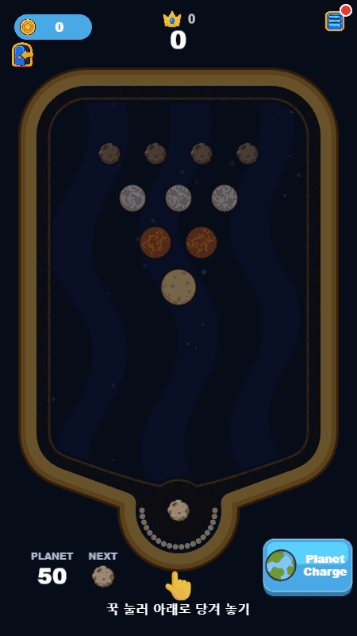
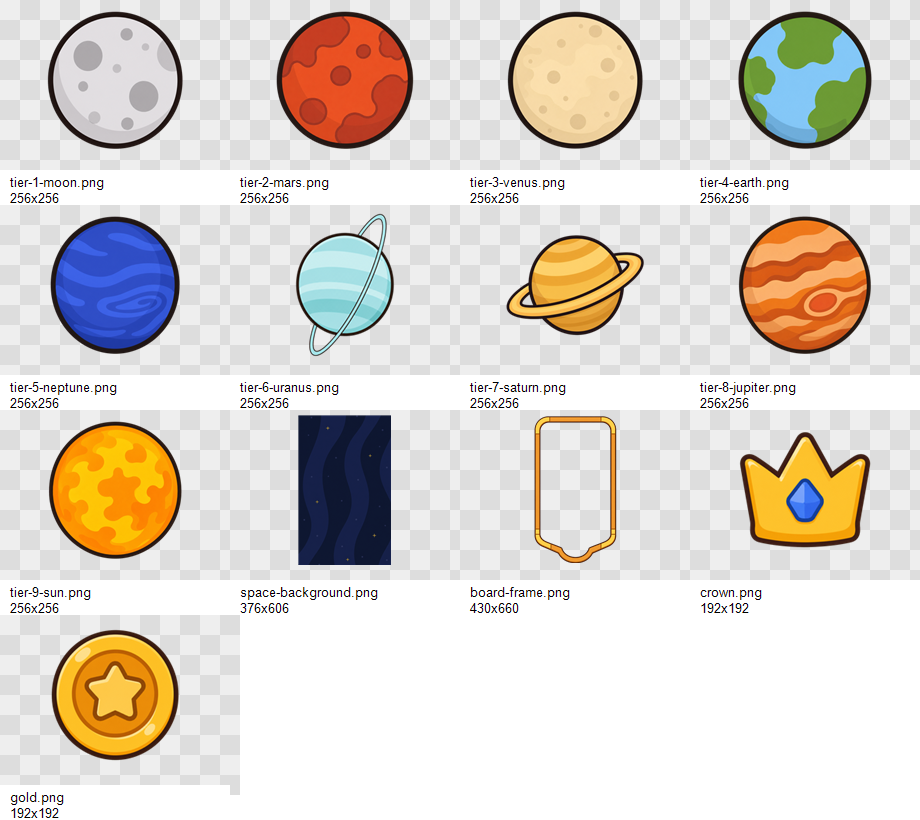

# GALAXY PINBALL

**GALAXY PINBALL**은 세로형 HTML5 물리 머지 게임 프로토타입입니다. 내부 기획명은
**Planet Pool Merge**이며, 풀 게임의 조준/반사 감각과 Suika식 성장 머지를 결합한
캐주얼 퍼즐 게임입니다.

<p>
  
</p>

위 GIF는 실행 중인 게임을 450x800, 9:16 브라우저 뷰포트에서 직접 촬영한 실제 인게임
플레이 장면입니다. Infinite 모드의 주요 플레이 화면에서 행성 발사, 충돌, 합성, 점수 상승,
콤보 피드백이 보이도록 캡처했습니다.

## 어떤 게임인가

플레이어는 화면 하단 고정 발사대에서 행성 공을 발사합니다. 행성을 뒤로 당겼다가 놓으면
드래그 반대 방향으로 발사되고, 행성은 골드 프레임의 우주 보드 안에서 벽과 다른 행성에
부딪히며 튕깁니다. 같은 등급의 행성끼리 충돌하면 다음 단계 행성으로 합성됩니다.

짧은 모바일 세션에 맞춘 반복 흐름입니다.

1. 현재 발사 행성과 Next 미리보기를 확인합니다.
2. 하단 발사대에서 당기고 조준한 뒤 놓습니다.
3. 벽 반사와 보드 위 행성 배치를 이용해 같은 등급끼리 충돌시킵니다.
4. 행성 사다리를 따라 상위 행성으로 합성하고 점수와 콤보 보너스를 얻습니다.
5. 해왕성, 토성, 태양, 최종 블랙홀까지 더 높은 행성을 만드는 것을 노립니다.

## 게임 리소스

<p>
  
</p>

프로토타입 리소스는 [game/public/assets](game/public/assets/)에 정리되어 있습니다.

- 소행성부터 블랙홀까지 11단계 행성 스프라이트.
- 우주 보드 배경과 골드 프레임 플레이필드 방향성.
- 점수, 메뉴, 상점, 출석, 미션, 룰렛, 설정에 쓰는 캐주얼 모바일 UI 아이콘.
- 생성형 리소스의 프롬프트 기록과 산출물 메타데이터.

## 실행

플레이 가능한 프로토타입은 [game/](game/)에 있고, 기획 정본은 [docs/](docs/)에 있습니다.

```bash
cd game
npm install
npm run dev
```

브라우저에서 http://localhost:5199/ 를 엽니다.

검증용 명령:

```bash
cd game
npm run typecheck
npm run build
npx playwright test
```

## 기술 스택

- Vite + TypeScript: 브라우저 프로토타입 빌드와 타입 안정성.
- PixiJS: 2D 렌더링, 행성 스프라이트, UI, 이펙트, 보드 표현.
- Matter.js: 원형 바디 물리, 벽 반사, 충돌, 합성 트리거.
- Playwright: 런타임 `window.__game` 디버그 계약을 통한 수용 테스트.

## 프로젝트 맵

- [docs/README.md](docs/README.md) - GDD 진입점과 에이전트 실행용 기획문서.
- [game/README.md](game/README.md) - 프로토타입 실행 안내.
- [game/src/GameScene.ts](game/src/GameScene.ts) - 런타임 구성 루트.
- [game/public/assets/README.md](game/public/assets/README.md) - 생성 리소스 인벤토리.
- [readme-assets/gameplay-9x16.gif](readme-assets/gameplay-9x16.gif) - README용 9:16 실제 플레이 GIF.
