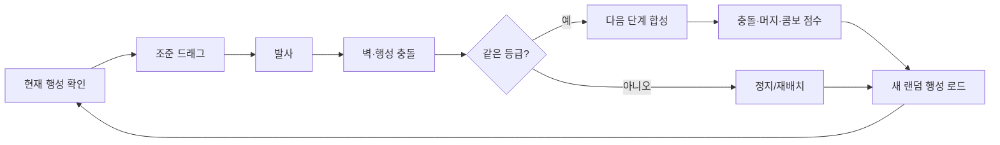

# Core Loop — 8 단계

`Planet Pool Merge`는 하단 고정 발사대에서 행성 공을 조준·발사해, 보드 위 **같은 등급 행성끼리
충돌시켜 다음 단계로 합성**하는 세로형 물리 머지 게임이다. 행성 사다리(11단계) 순서는
[[../10-concept/index|컨셉]]에 정본이 있고, 단계별 수치(반지름·기본 점수)는
[[../40-balancing/index|밸런싱]]에 단일 테이블로 둔다.

한 사이클은 다음 8단계를 반복한다. 루프 자체는 두 모드가 공유하며, **세션의 시작 카운트·종료
조건은 게임 모드가 정한다**([[game-modes]]). 재미는 점수·최고 달성 행성·합성 횟수·블랙홀 달성
여부로 검증한다([[../70-verification/index|검증]] 연동).

1. **발사대의 현재 행성을 확인한다.** — 행성 선택 → [[../30-systems/launch-queue]]
2. **현재 행성을 누르고 뒤로 당겨 조준한다.** — 조준/파워 → [[../30-systems/launcher]]
3. **손을 놓아 행성을 발사한다.** (드래그 반대 방향)
4. **행성이 벽과 다른 행성에 충돌한다.** (보드 outline 전 경계가 충돌 벽, 포켓 없음)
5. **같은 등급 행성끼리 충돌하면 다음 단계 행성으로 합성된다.** — 합성 규칙 → [[../30-systems/merge-rules]]
6. **충돌 점수(벽 +1·행성 +3)와 합성 시 생성 등급 점수, 콤보 보너스가 반영된다.** — 점수 수치 → [[../40-balancing/index]]
7. **발사대에 새 랜덤 행성이 로드된다.** (해금 연동 낮은 단계) — [[../30-systems/launch-queue]]
8. **다음 발사를 반복한다.**

> [!note] 발사 가능 조건
> 보드 위 물리가 완전히 멈추지 않아도 다음 발사는 가능하다(발사 후 짧은 쿨다운만 둔다).
> 정확한 쿨다운·파워 정규화 수치는 [[../40-balancing/index]]·[[../30-systems/launcher]]에 둔다.

## 범위 (MVP)

| 포함 (구현 범위) | 제외 (비범위) |
|---|---|
| 드래그 조준·발사대 · 벽 충돌·반사 물리 | 포켓 및 포켓 UI |
| 같은 등급 합성 + merge lock | Shake · Change Ball 버튼 |
| 충돌(벽 +1·행성 +3) + 머지 등급 점수 + 콤보 보너스 | 상단 진행 트랙 · 미도달 단계 실루엣 |
| 발사 행성 랜덤 선택(해금 연동) · 중앙 초기 랙 | 랭킹(리더보드) · 튜토리얼 |
| **게임 모드(Infinite/Stage)·카운트·세션 종료·결과창**([[game-modes]]) | 광고 보상 실연동(더미 미션만) |
| **코인 경제·메타 팝업·사운드·localStorage 저장** | — |

종료 조건은 게임 모드가 정한다([[game-modes]]). 제외 항목은 의도적 비범위(프로토타입 스코프 펜스).

## 관련
- [[index]] — 섹션 카탈로그
- [[game-modes]] — Infinite/Stage 모드가 루프에 씌우는 카운트·종료 조건
- [[play-flow]] — 세션 흐름·시작 상태(초기 랙)·온보딩
- [[../30-systems/index]] — 발사대·큐·합성·초기 랙 시스템 상세
- [[../40-balancing/index]] — 단계별 반지름·점수, 보충 확률, 드래그/파워/쿨다운 수치
- [[../70-verification/index]] — 검증축 합격선(첫 5발 내 1회 합성 등)
